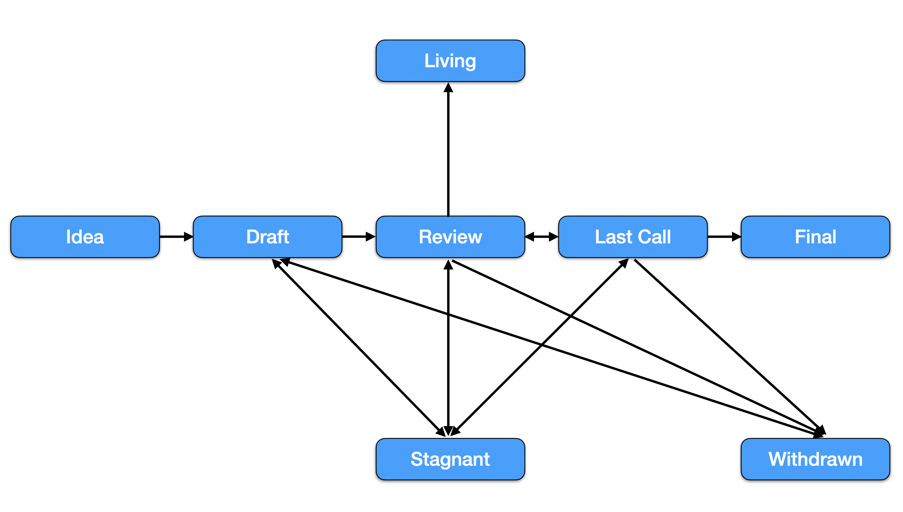

<pre>
  BIP: 1
  Title: Purpose and Guidelines
  Status: Living
  Type: Process
  Created: 2020-01-10
</pre>

# BIP 1: Purpose and Guidelines

- [BIP 1: Purpose and Guidelines](#BIP-1-purpose-and-guidelines)
  - [1.  What is BIP?](#1--what-is-bip)
  - [2.  BIP Rationale](#2--bip-rationale)
  - [3.  BIP Types](#3--bip-types)
  - [4.  BIP Workflow](#4--bip-workflow)
  - [5.  BIP Format](#5--bip-format)
  - [6.  Reference](#6--reference)
  - [7.  License](#7--license)

## 1.  What is BIP?

BIP stands for BOSagora Evolution Proposal. Each BIP will be a proposal document providing information to the BOSagora. The BIP should provide a concise technical specification of the feature or improvement and the rationale behind it. Each BIP proposer is responsible for building consensus within the community and documenting dissenting opinions. Each BIP has a unique index number.

## 2.  BIP Rationale

BIP is the primary mechanism for proposing new features, for collecting community technical input on issues, and for documenting the design decisions that go into BOSagora. Because BIPs are maintained as text files in a versioned repository, their revisions are the historical records of feature proposals.

For BOSagora contributors, it is a convenient way to track the progress of their implementation by BIPs. It will help end users to know the status of a given feature, function or improvement.

##  3.  BIP Types

There are three types of BIP:

- **Standards**: A Standards BIP describes functional changes on BOSagora, such as a change to the network protocol, proposer selection mechanism in consensus algorithm, change in block size or fee mechanism in application level. It will effect the implementation of BOSagora.
- **Information**: An Information BIP will clarify some concepts of the BOSagora, it may not effect the BOSagora client implementation.
- **Process**: This kind of proposal will change the workflow of BOSagora working process, like this BIP itself.

## 4.  BIP Workflow

*Figure 1: BIP workflow*

Once the idea is accepted, each status change is requested by the BIP author and reviewed by the BIP editors. Use a pull request to update the status.

- **Idea**: If you have an idea but not sure if it worths a BIP or not, you may discuss with the community first before you put too much effort. 
- **Pre-Draft**: If your idea is accepted, it is still not a BIP yet. A formal document will be needed to describe your idea, the Pre-Draft document should follow the BIP format. And you need to create a pull request and the BIP editors will review it.
- **Draft**: Once the Pre-Draft pull request is accepted by the community and reviewed by the BIP editors, it can be merged. The pull request number will be used as the BIP number, which means it is a legal BIP now. The BIP editors will add the status, then it will be recorded and maintained by the community. The BIP author should keep pushing it forward, the author can update the BIP by creating new pull requests.
- **Final**: This proposal is finalized and a reference implementation should be provided.
- **Enabled**: This proposal is enabled in BOSagora mainnet, if it is a hard fork, the fork number has reached.

Other exceptional statuses include:

- **Living**: A BIP will be long-term maintained, like this BIP.
- **Stagnant**: A BIP has not been updated for more than 6 months, it will enter Stagnant state.
- **Withdrawn**: A BIP that is dropped and will not be implemented. Usually, it is due to some prerequisite conditions that are not true anymore.

## 5.  BIP Format
It is important to keep BIP clear and well organized, BIPs need to follow this format(BIP1 is excepted):
- Preamble: a short metadata about the BIP, it should be put at the top of the BIP. Here is an example:
<pre>
  BIP: 127
  Title: Temporary Maintenance Mode for Validators
  Status: Enabled
  Type: Standards
  Created: 2022-01-10
  Author(optional): it can be a name or an email.
  Description(optional): enabled by BOSagora Euler upgrade, block height 18907621, Jun-22-2022
  Discussions(optional): could be a link to the bnb forum, where it is discussed.
</pre>
- Summary: a very short summary with a single sentence, someone could understand the purpose of the BIP by reading it even without technical background.
- Abstract(optional): a short paragraph to give more introduction about the BIP, could be multi-sentence. Someone could read the abstract to know the general workflow of the BIP.
- Motivation: it is a critical part of the BIP, it should explain very clearly why this proposal is needed.
- Specification: it is another critical part, the detail workflow and configuration need to be provided. Diagrams are needed to make it easy to be understood if it is hard to be described in text.
- Rational(optional): it adds more information to support the specification, i.e. why the design in the specification is preferred.
- Forward Compatibility(optional): if the BIP will introduce compatibility problems in the future, probably because of some scheduled changes in the future that would be broken by the BIP. In such case, this part is a must to describe the detail incompatibilities and how to deal with it.
- Backward Compatibility(optional): similar to Forward Compatibility, if the BIP introduces compatibility problems to the previous or current system, then this part is a must to describe the detail incompatibilities and how to deal with it.
- Reference Implementations(optional): before the BIP enters the Final state, a reference implementation will be needed. However, if the BIP does not need a implementation, it can be omitted.
- License: to show the copyright of the BIP.
## 6.  Reference

Ethereum Improvement Proposals:  [https://github.com/ethereum/EIPs](https://github.com/ethereum/EIPs/blob/master/EIPS/eip-1.md)

Bitcoin Improvement Proposals:  <https://github.com/bitcoin/bips>

##  7.  License

All the content are licensed under [CC0](https://creativecommons.org/publicdomain/zero/1.0/).
